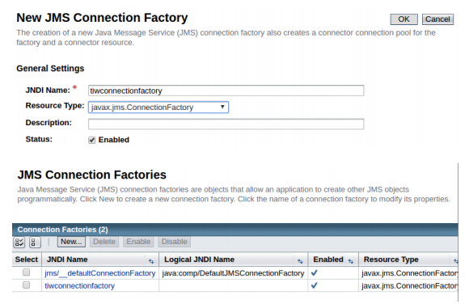
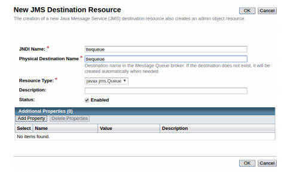

# exampleJMS

1. Create a factory and a queue in the application server

  1. Open the administration console of Glassfish/Payara
    - Right-click in the GlassFish entry in the “Servers” tap
    - The user and password is admin/admin
  2. Create a new JMS Connection Factory
    - Resources > JMS Resources > Connection Factories > click ‘New’
    - Make sure ‘enabled’ is checked The Resource Type drop-down menu has three options:
      - javax.jms.TopicConnectionFactory - used to create a connection factory that creates JMS topics for JMS clients using the pub/sub messaging domain
      - javax.jms.QueueConnectionFactory - used to create a connection factory that creates JMS queues for JMS clients using the PTP messaging domain
      - javax.jms.ConnectionFactory - used to create a connection factory that creates either JMS topics or JMS queues 
      
      You can select javax.jms.ConnectionFactory

    
    
  3. Set up a JMS Message Queue / JMS Message Topic
    - Resources > JMS Resources > Destination Resources > click ‘New’
      - Make sure ‘enabled’ is checked
      
    The resource type must be queue or topic depending on the type of queue you aim to create.
    
2. Complete the servlets of the project example:
  1. SendMessageQueueServlet: sends to a queue a message receives in a parameter “message”of the request
  2. ReadMessageQueueServlet: reads the messages in the queue and shows them on screen
  3. ReadMessageQueueBrowserServlet: reads the messages in the queue withouth deleting them and shows them on screen
